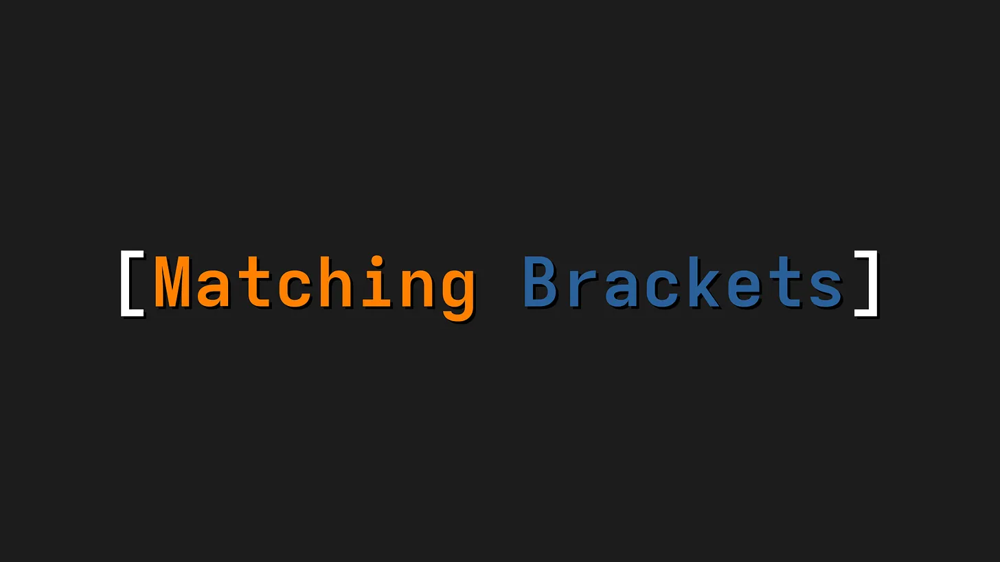
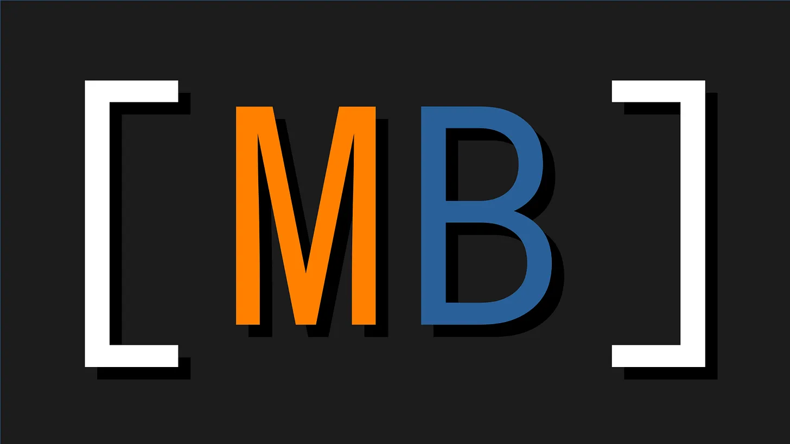
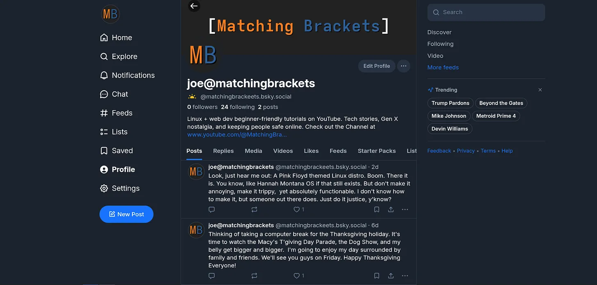

# [**Starting a New YouTube Channel About Linux From Scratch**](https://matchingbrackets.substack.com/p/starting-a-new-youtube-channel-about)

***Learning Linux, web development, and how to do YouTube, and building it all in public for everyone to see.***

by Joe, December 13, 2025

---

Hi! My name is Joe, and I’m starting a new YouTube Channel called [**“Matching Brackets.”**

This channel is about technology, but from a beginner-friendly point of view. I’ve been using Linux as my desktop computer for quite a few years now. People say that “this” year is going to be the Year of the Linux Desktop. And I’m over here like, “What do you mean, “this is the year?” I’ve been using one version of Linux or another as my desktop computer for a good 5+ years! Come and join me. The water is perfect!”

I see it a few times a day. Especially over in Reddit. Someone saying they have a computer with these specs… and which would be the best Linux distro for them to start out with. More and more people are looking at Linux as a viable alternative to the operating systems that they’ve used in the past.

And that is exactly how I started. Me and Windows just weren’t seeing eye to eye and it was time for something new. Enter Linux, or Enter Ubuntu (which is where I started). It wasn’t easy, and I struggled. But the most important thing was that I learned something new, and that was exciting. I hadn’t been excited using a operating system ever before. That is, before I switched to Linux.

I’m still learning how to best use Linux as my daily driver because I do still make mistakes, and since more people are looking at Linux as a real replacement for Windows, I thought it might be useful to document my journey publicly. Wins and losses, you’ll see them all. If you’re curious about Linux but feel overwhelmed by overly technical explanations, then this channel is for you. I hope you like it well enough to subscribe and share your thoughts in the comments, because I’d really like to hear from you.

## What is Matching Brackets?
**Matching Brackets** is my attempt to learn and share at the same time. I’m interested in:
- Learning Linux as a beginner and using it day to day.
- Front-end Web Development.
- Staying safe from online scams
- Inspirational stories where technology genuinely helps people.

I’m not claiming to be an expert. In fact, I’m very much the opposite. I’m learning in public and explaining things as simply and clearly as I can, because I know how frustrating technology can feel when everything assumes you already know the basics.

## Why Linux?
Linux has a reputation for being difficult, but I don’t think that’s the case. I can’t say that overall my experience with Linux has been a smooth one. It’s just that troubleshooting issues, and repairing of some broken code might be a little different to replace than what you would do in the Windows world, or even the Mac world, for that matter. Linux is different, but I know you can make the switch.

Do you know how I know? Because I would see countless Windows users make the switch over to Mac when I worked in the Apple retail store in 2006. And if they can do it, what’s stopping you, eh?

While making these videos, I kind of want you to see me get stuck… I kind of want you to see me fail. Because then you get to see how I handle fixing the situation, and you gain that knowledge as well. I’ll tell you everything that is going on, and you’ll see it as well. I certainly could edit out the mistakes. But where’s the fun in that? This won’t be a polished “experts-only” Linux YouTube channel. It’s a learning journey. So, as long as we’re learning, right?

## Technology That Helps People
I’m also drawn to stories where the technology makes a real difference in people’s lives. We rely on technology so much that we often take it for granted, but sometimes it does something extraordinary. Like advanced prosthetics that allow someone who has lost a leg to run again. Those stories matter to me, and I want to make space for them here.

## I'm Building This in public
I’ll be honest: I have no idea what it takes to make a good YouTube channel. I’m not even sure how to define what “good” means yet. What I do know is that I’m willing to learn, experiment, and put in the work to build something I can be proud of.

I’ve created accounts on [**Bluesky**](https://bsky.app/profile/matchingbrackeets.bsky.social), [**Mastodon**](https://techhub.social/@matchingbrackets), [**Reddit**](https://www.reddit.com/user/MatchingBrackets/), and at [**GitHub**](https://github.com/matchingbrackets) to share my progress and connect with people along the way. On GitHub, I’ll be sharing things like my website code. Not because it’s perfect, but because someone else might find it useful or want to improve on it.

This Substack blog will be a place for longer thoughts, planning, and reflection as I work toward launching this new channel.

## Join Me From The Beginning
No one builds anything meaningful alone. If what I’m doing here resonated with you, I’d love for you to be part of the community and a vocal part of this channel’s growth.

My first Matching Brackets video is planned for January 1, 2026. If you have the time, I’d really appreciate it if you watched and even just stopped by to say “hello.”

For now, it’s back to planning, learning, and working on the foundation, including a business plan. So this channel starts on solid ground.

Thanks for being here at the very beginning. It means a lot to me.

**Everything I create here is free**. But if you’d like to support my journey as I start my Linux YouTube channel, you can become a paid subscriber by entering your email address above to receive new posts directly in your email. You will be charged for the subscription, but think of it as a way to contribute to my work. No pressure — it just helps me keep going. ❤️

***Subscribe Link***

Draft: 12/23/2025
